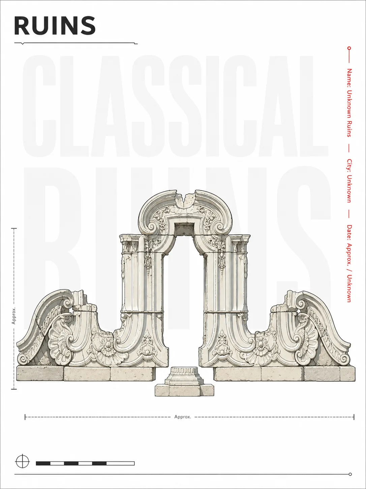
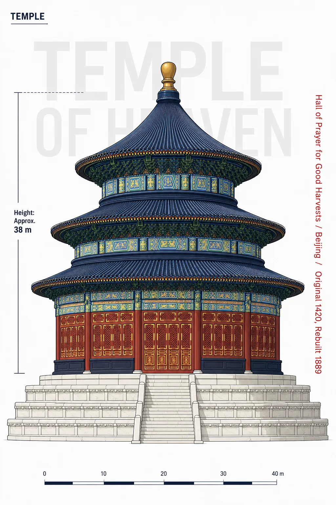

# 提示词仓库

这个仓库是一个基于文件的 LLM 提示词库，用来存放可复用、可管理、可版本化的提示词。
目标很简单：好找、好用、好扩展。

## 目录结构

```text
prompts/
  coding/
  writing/
  business/
  personal/
  multimodal/
snippets/
  <snippet-pack>/
.agents/skills/prompt-archiver/
```

每个提示词单独放在一个目录里：

```text
prompts/<category>/<slug>/
├── <slug>.prompt.md
└── meta.yaml
```

可选文件：

- `examples/examples.md`：示例说明和预览图信息
- `examples/preview-*.webp`：轻量生图预览图
- `tests.yaml`：轻量测试样例

可复用片段包放在 `snippets/<slug>/` 下：

```text
snippets/<slug>/
├── meta.yaml
├── README.md
└── README.zh-CN.md
```

## 分类说明

- `coding`：代码审查、调试、重构、测试、架构、Git 流程
- `writing`：写作、改写、润色、翻译、总结、邮件、文章
- `business`：产品、运营、市场、销售、调研、会议、策略
- `personal`：计划、复盘、学习、决策辅助、生活管理
- `multimodal`：图片生成、图片编辑、图片分析、音频、视频、视觉提示词

## 命名规则

- 使用简短的英文 `hyphen-case` slug
- 一个提示词一个目录
- 尽量使用具体名称，避免过于泛化
- `<slug>.prompt.md` 中保留原始提示词内容

## 元数据

`meta.yaml` 用来描述提示词，常见字段包括：

- `id`
- `name`
- `name_zh`
- `version`
- `status`
- `category`
- `summary`
- `summary_zh`
- `tags`
- `tags_zh`
- `inputs`
- `outputs`
- `language`
- `created`
- `updated`

## 新增提示词

如果你在使用 Codex，可以直接使用 `prompt-archiver` skill。
它会帮你判断提示词属于哪个分类，创建目录，把原始提示词写入 `<slug>.prompt.md`，再补上对应的元数据。
提示词文件名应与目录 slug 保持一致，例如 `reusable-workflow-asset-audit.prompt.md`。

## 生图预览图

对于带有生成图片结果的多模态提示词，仓库只提交轻量 WebP 预览图，原始 PNG/JPG 或高清结果保留在本地，或上传到 OSS 等外部存储。

推荐目录结构：

```text
prompts/multimodal/<slug>/
├── <slug>.prompt.md
├── meta.yaml
└── examples/
    ├── preview-01.webp
    ├── preview-02.webp
    ├── examples.md
    └── source/
        └── original-01.png
```

`examples/preview-*.webp` 用于提交到 Git，方便 README、GitHub 浏览和离线预览。`examples/source/` 已被 Git 忽略，用来临时存放本地高清原图或转换输入。

如果你现在有一张原图要加入某个提示词目录：

1. 把原图放到该提示词的本地源图目录：

   ```powershell
   $slug = "silhouette-universe-collectible-poster"
   New-Item -ItemType Directory -Force "prompts/multimodal/$slug/examples/source"
   Copy-Item "D:\path\to\original.png" "prompts/multimodal/$slug/examples/source/original-01.png"
   ```

2. 如果还没有安装依赖，先安装一次：

   ```powershell
   npm install
   ```

3. 生成 WebP 预览图：

   ```powershell
   npm run preview -- "prompts/multimodal/$slug"
   ```

   脚本会输出 `examples/preview-01.webp`、`preview-02.webp` 等文件，自动创建或更新 `examples/examples.md`，并回填 `meta.yaml` 里的 `preview:` 区块。它会补上可以可靠推断的字段，包括图片尺寸、预览图体积、原图路径和体积、提示词版本，以及可识别的 ChatGPT 文件名时间戳日期或备注。已有非空示例字段会保留。

   如果确实需要覆盖已有预览图，直接调用脚本：

   ```powershell
   node scripts/convert-previews.mjs "prompts/multimodal/$slug" --force
   ```

4. 检查自动生成的预览图元数据；如果想调整 README 目录中的缩略图顺序，或隐藏某张图，可以改这里：

   ```yaml
   preview:
     image: 'examples/preview-01.webp'
     gallery:
       - 'examples/preview-01.webp'
       - 'examples/preview-02.webp'
   ```

   如果重新生成预览图时想保留手动调整过的 `preview:` 区块，可以给 `scripts/convert-previews.mjs` 传入 `--no-meta`。

5. 打开 `examples/examples.md`，检查并补充无法自动推断的字段，例如模型、seed、人工备注，以及外部 `Original` 原图链接。如果高清图已经上传到 OSS，就把链接填在 `Original` 后面。

6. 重新生成 README 目录，并检查将要入库的文件：

   ```powershell
   npm run catalog
   git status --short
   npm run catalog:check
   ```

提交 `examples/preview-*.webp` 和 `examples/examples.md`。不要提交 `examples/source/` 里的原图，除非你明确要覆盖忽略规则。

## 提示词目录

下面的目录会根据每个提示词的 `meta.yaml` 自动生成。
不要手动编辑生成区块，需要更新时运行：

```sh
node scripts/generate-prompt-catalog.mjs
```

检查目录是否为最新：

```sh
node scripts/generate-prompt-catalog.mjs --check
```

## 片段目录

片段包是可复用的参考资料、模板、示例或词汇表，可以在编写提示词时按需摘取。
下面的目录会根据每个片段包的 `meta.yaml` 自动生成：

```sh
node scripts/generate-snippet-catalog.mjs
```

检查片段目录是否为最新：

```sh
node scripts/generate-snippet-catalog.mjs --check
```

<!-- snippet-catalog:start -->
<!-- 本区块由 snippets/*/meta.yaml 自动生成，请不要手动编辑标记之间的内容。 -->

| 名称 | 类型 | 状态 | 语言 | 更新日期 | 标签 | 介绍 | 片段 |
| --- | --- | --- | --- | --- | --- | --- | --- |
| 动画提示词词汇参考库 | 词汇表 | 草稿 | 双语 | 2026-06-02 | 动画, 动效, 界面, 提示词 | 用于描述 UI 动效、动画行为和交互反馈的可复用提示词词汇参考库。 | [README.zh-CN.md](snippets/animation-vocabulary/README.zh-CN.md) |

<!-- snippet-catalog:end -->

在新的 clone 中启用提交前自动更新目录：

```sh
node scripts/install-git-hooks.mjs
```

pre-commit hook 会从 Git 暂存区读取已暂存的 `meta.yaml`，更新中英文 README 里的目录区块，并把 README 更新加入本次提交，确保目录与提交内容一致。

<!-- prompt-catalog:start -->
<!-- 本区块由 prompts/*/*/meta.yaml 自动生成，请不要手动编辑标记之间的内容。 -->

### 业务

| 名称 | 状态 | 版本 | 语言 | 更新日期 | 标签 | 介绍 | 提示词 |
| --- | --- | --- | --- | --- | --- | --- | --- |
| 可复用工作流资产审计 | 草稿 | 1.0.0 | zh-CN | 2026-06-01 | 工作流审计, 自动化, 知识管理, Codex, 运营 | 审计近期工作记录，识别值得封装为 skill、子代理或自动化的重复手动流程。 | [reusable-workflow-asset-audit.prompt.md](prompts/business/reusable-workflow-asset-audit/reusable-workflow-asset-audit.prompt.md) |

### 个人

| 名称 | 状态 | 版本 | 语言 | 更新日期 | 标签 | 介绍 | 提示词 |
| --- | --- | --- | --- | --- | --- | --- | --- |
| 苏格拉底式自我探索对话 | 草稿 | 1.0.0 | zh-CN | 2026-06-02 | 个人反思, 苏格拉底式对话, 自我探索, 日记 | 引导一场苏格拉底式自我探索对话，每次基于上一回答追问一个问题，并在触及深层模式后输出剖析报告。 | [socratic-self-inquiry-dialogue.prompt.md](prompts/personal/socratic-self-inquiry-dialogue/socratic-self-inquiry-dialogue.prompt.md) |

### 多模态

| 名称 | 预览 | 状态 | 版本 | 语言 | 更新日期 | 标签 | 介绍 | 提示词 |
| --- | --- | --- | --- | --- | --- | --- | --- | --- |
| 建筑信息图矢量海报 |  | 草稿 | 1.0.0 | zh-CN | 2026-06-02 | 多模态, 图片编辑, 建筑, 信息图, 矢量插画, 海报设计 | 将上传的建筑照片转化为正立面二维矢量信息图海报，加入克制的标注、测量线和测绘档案式排版。 | [architectural-infographic-vector-poster.prompt.md](prompts/multimodal/architectural-infographic-vector-poster/architectural-infographic-vector-poster.prompt.md) |
| 建筑冰箱贴图标 |  | 草稿 | 1.0.0 | zh-CN | 2026-06-02 | 多模态, 图片编辑, 建筑, 图标设计, 冰箱贴, 旅行纪念品 | 从真实照片中提取具有识别度的建筑特征，转化为简洁、略带立体感的旅行纪念品式冰箱贴图标。 | [architecture-fridge-magnet-icon.prompt.md](prompts/multimodal/architecture-fridge-magnet-icon/architecture-fridge-magnet-icon.prompt.md) |
| 笨拙的 MS Paint 重绘 |  | 草稿 | 1.0.0 | en-US | 2026-06-02 | 多模态, 图片编辑, 图片生成, 风格迁移, 画图软件 | 将参考图以故意笨拙、潦草的 MS Paint 鼠标涂鸦风格重绘，呈现低质量的逐像素感觉。 | [clumsy-ms-paint-redraw.prompt.md](prompts/multimodal/clumsy-ms-paint-redraw/clumsy-ms-paint-redraw.prompt.md) |
| 多巴胺抽象曲线矢量插画 |  | 草稿 | 1.0.0 | zh-CN | 2026-06-02 | 多模态, 图片生成, 矢量插画, 抽象艺术, 多巴胺色系, 极简主义 | 生成纯白背景上的极简多巴胺色系矢量插画，以抽象线条、曲面和不规则弧形色块构成先锋艺术效果。 | [dopamine-abstract-curve-vector-art.prompt.md](prompts/multimodal/dopamine-abstract-curve-vector-art/dopamine-abstract-curve-vector-art.prompt.md) |
| 图像取证式复刻生图提示词 |  | 草稿 | 1.0.0 | zh-CN | 2026-06-02 | 多模态, 图像分析, 图像生成, 提示词工程, 摄影, 瑕疵分析 | 以取证式视角分析参考图片的摄影缺陷、压缩痕迹和随手拍质感，并生成可复刻原图的 AI 生图提示词。 | [image-forensic-reconstruction-prompt.prompt.md](prompts/multimodal/image-forensic-reconstruction-prompt/image-forensic-reconstruction-prompt.prompt.md) |
| 韩式稚拙扁平照片重绘 |  | 草稿 | 1.0.0 | zh-CN | 2026-06-02 | 多模态, 图片编辑, 风格迁移, 韩式插画, 扁平设计, 稚拙艺术 | 将照片重绘为可爱的韩式稚拙扁平插画，以粗糙间断黑色轮廓、高饱和纯色色块和亮蓝背景呈现。 | [korean-naive-flat-photo-redraw.prompt.md](prompts/multimodal/korean-naive-flat-photo-redraw/korean-naive-flat-photo-redraw.prompt.md) |
| 潦草聊天表情包 |   | 草稿 | 1.0.0 | zh-CN | 2026-06-01 | 多模态, 图片生成, 表情包, 聊天贴纸, 风格参考, 中文 | 根据参考图生成 16 格中文聊天表情包，风格刻意保持粗糙的画图软件鼠标手绘感。 | [messy-chat-sticker-pack.prompt.md](prompts/multimodal/messy-chat-sticker-pack/messy-chat-sticker-pack.prompt.md) |
| 极简建筑文字排版海报 |  | 草稿 | 1.0.0 | zh-CN | 2026-06-02 | 多模态, 图片编辑, 建筑, 海报设计, 文字排版, 极简主义 | 将参考建筑转化为高端竖版极简海报，以建筑后方超大英文排版和克制的编辑式标注强化建筑感。 | [minimalist-architectural-typography-poster.prompt.md](prompts/multimodal/minimalist-architectural-typography-poster/minimalist-architectural-typography-poster.prompt.md) |
| 单色中式极简矢量剪影 |  | 草稿 | 1.0.0 | zh-CN | 2026-06-02 | 多模态, 图片生成, 矢量插画, 中式美学, 极简主义, 单色, 剪影 | 生成沉稳优雅的中式极简矢量剪影，以单色填充、简化几何造型和上深下浅的细微渐变呈现。 | [monochrome-chinese-minimalist-vector-silhouette.prompt.md](prompts/multimodal/monochrome-chinese-minimalist-vector-silhouette/monochrome-chinese-minimalist-vector-silhouette.prompt.md) |
| 噪点渐变国潮插画 |  | 草稿 | 1.0.0 | zh-CN | 2026-06-02 | 多模态, 图片生成, 图片编辑, 风格迁移, 国潮, 渐变, 矢量插画 | 将图片转化为几何化的国潮矢量插画，以青橙马卡龙渐变、柔和空间层次和手绘质感营造治愈氛围。 | [noise-gradient-guochao-illustration.prompt.md](prompts/multimodal/noise-gradient-guochao-illustration/noise-gradient-guochao-illustration.prompt.md) |
| 轮廓宇宙收藏版叙事海报 |   | 草稿 | 1.0.0 | zh-CN | 2026-06-05 | 多模态, 图像生成, 海报设计, 叙事设计, 水彩, 轮廓 | 根据可变主题生成高审美收藏版叙事海报，让主题世界依附于最具象征性的主轮廓展开。 | [silhouette-universe-collectible-poster.prompt.md](prompts/multimodal/silhouette-universe-collectible-poster/silhouette-universe-collectible-poster.prompt.md) |

<!-- prompt-catalog:end -->

## 设计原则

把提示词当作资产，而不是散落的笔记。
保留原文，只加够用的元数据，让仓库保持简单、稳定、可持续维护。
